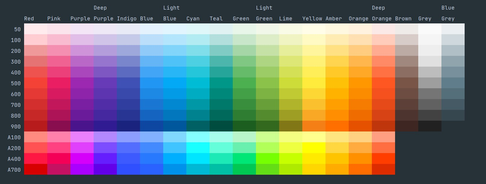
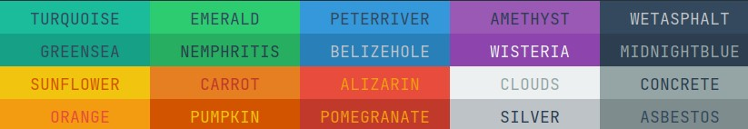
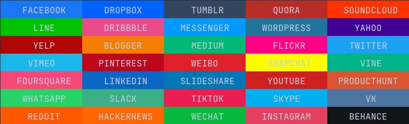

# 🐦Coloratura

##### Awsome **cprint()** function to colored terminal text. Supported full RGB! 😍

## Installation

You can install coloratura with **pip** as follows:

```
pip install coloratura
```

## Usage

First of all, get the basic cprint functions and selected color palettes:

```python
from coloratura import cprint, Pantone, Bit4
```

Printing colored text is incredibly ea``sy:

```python
cprint('This text is in the CLASSIC BLUE color from the Pantone palette', color=Pantone.CLASSIC_BLUE)
```

**Easy right?**
But what if you want to print text with a colored background?

```python
cprint('This is great!', color=Pantone.EMERALD, bg=Pantone.ULTIMATE_GRAY)
```

You can also add styles to the font:

```python
cprint('This string is italic and green', color=Bit4.GREEN, styles=['italic'])
```

You can mix multiple text styles

```python
cprint('This string is italic and bold', styles=['italic', 'bold'])
```

## Colors and styles

### List of all styles

> bold, italic, underline, strong-underline, crossed-out, framed

**Remember:** Styles can be mixed together by including them in the list of strings

### List of all colors from the pantone palette:

> 
> 
> 
> 
> 
> 
> 
> 
> 
> 
> 
> 
> 
> 
> 

### List of all colors from the 4bit palette:

> 
> 
> 
> 
> 
> 
> 
> 
>
> 
> 
> 
> 
> 
> 
> 
> 

### List of all colors from the Material palette:



### List of all colors from the Flat palette:



### List of all colors from the Social palette:



**..pssst!**
Using .palette()  you can check all the colors!

```python
# example
Material.palette()
```

**Too little? 🤔**

With the Color class you can define your own colors in the full RGB spectrum 🤯

Look how simple it is:

```python
CUSTOM_COLOR = Color('rgb', 191, 25, 50)
```

> 

### *..and this is just the beginning of this great library!* 💚
